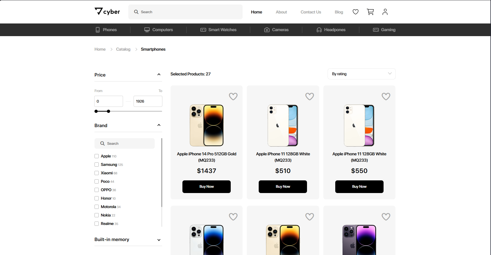
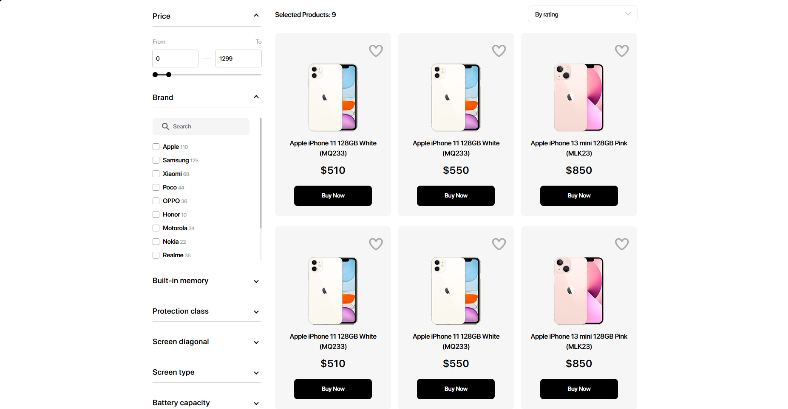
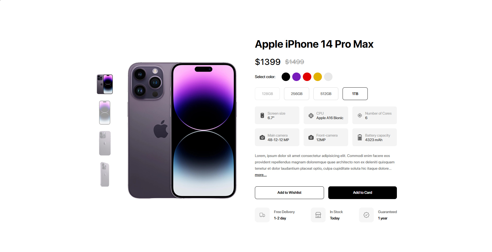

# Cyber Market — Интернет-магазин на Vanilla JS

Полноценный многостраничный интернет-магазин электроники, написанный с нуля на **HTML, CSS и Vanilla JavaScript**.

### Особенности:
- Адаптивная верстка (мобильная + десктоп)
- Динамическая генерация карточек товаров
- Фильтры по цене, бренду, памяти
- Пагинация с умными кнопками
- Страница товара с выбором цвета/памяти
- Избранное и корзина (в разработке)

### Технологии:
- HTML5
- CSS3 (BEM, переменные, grid/flex)
- Vanilla JavaScript (без библиотек)

### Скриншоты:

### Как запустить:
1. Склонируй репозиторий
2. Открой `index.html` в браузере

Проект в активной разработке. Следи за обновлениями!

Made with 🔥 by [NikitaRencaev] (15 лет)
